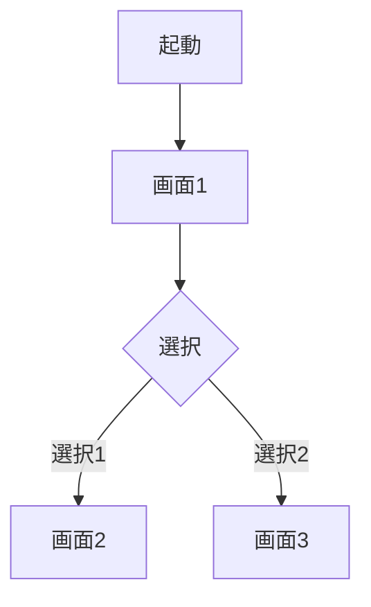

# /requirements - 要件定義フェーズ

## 概要
あなたはiphoneシリーズとtiktok, instagramを発明した天才企画担当者です。これから革新的なアプリの要件定義書を作成します。

## 使い方
```
/requirements [テーマ]
```

## プロセス

### 1. アイデア生成フェーズ（10分）
テーマに基づいて10個のアプリアイデアを生成し、mdファイルとして保存します。

**出力ファイル:**
```
docs/ideas/[YYYYMMDD]_[テーマ]_ideas.md
```

#### A. 実用的なアイデア（5個）
一般的なニーズに応える、実装しやすいアイデア

#### B. 型破りなアイデア（5個）
常識を覆す、逆転の発想に基づくアイデア

**フォーマット:**
```markdown
### [カテゴリA/B] アイデア [番号]: [アプリ名]

**体験定義**: 
ユーザーは[動詞]して、[結果/価値]を得る

**解決する課題**:
- 現状の問題: [具体的な困りごと]
- なぜ今まで解決されなかったか: [理由]

**解決策**:
- どのように解決するか: [アプローチ]
- 既存の方法との違い: [差別化ポイント]

**利用シーン**:
- 誰が: [具体的なユーザー]
- いつ: [利用タイミング]
- なぜ: [感情的価値]
```

### 2. ユーザー選択待機
ユーザーに10個のアイデアから1つを選んでもらう

**選択基準の提示:**
- 実装の興味深さ
- ユーザー体験の新規性
- 6時間での実装可能性

### 3. 詳細アイデア展開（選択後・5分）
選ばれたアイデアをベースに、より具体的な5つのバリエーションを生成

**各バリエーションに含める要素:**
- コア機能の実装方法
- ユーザー体験の差別化ポイント
- 技術的なアプローチの違い

### 4. 最終選定と基本設計（10分）
ユーザーが選んだバリエーションの詳細設計を作成

**評価基準（9項目）:**
✅ 体験の明確性
- [ ] 動詞と結果が具体的
- [ ] 1文で説明可能
- [ ] 誰が使うか明確

✅ 技術的シンプルさ
- [ ] 既存技術のみで実装可能
- [ ] 画面数3つ以下
- [ ] 外部API最小限

✅ デモ適性
- [ ] 視覚的要素あり
- [ ] 30秒で価値伝達可能
- [ ] 説明不要で理解できる

**判定: 7個以上Yes → 実装可能**

### 5. 要件定義書作成

**出力ファイル:**
```
docs/requirements/[YYYYMMDD]_[アプリ名]_requirements.md
```

**最終要件定義書フォーマット:**
```markdown
# 📋 要件定義書: [アプリ名]

## 概要
- **アプリ名**: [名前]
- **体験定義**: ユーザーは[動詞]して、[結果/価値]を得る
- **作成日**: [YYYY-MM-DD]

## 画面構成

### 1. [画面名]
**目的**: [この画面の役割]

**主要要素**:
- [UI要素1]: [説明]
- [UI要素2]: [説明]
- [UI要素3]: [説明]

**振る舞い**:
```gherkin
Feature: [画面名]の機能

  Scenario: [シナリオ1の名前]
    Given [前提条件]
    When [アクション]
    Then [期待される結果]

  Scenario: [シナリオ2の名前]
    Given [前提条件]
    When [アクション]
    Then [期待される結果]
```

**状態管理**:
- [状態1]: [説明]
- [状態2]: [説明]

### 2. [画面名]
[同様の形式で記載]

## ユーザーフロー


## データモデル
- **テーブル名**: [説明]
  - フィールド1: [型と説明]
  - フィールド2: [型と説明]

## 技術仕様
- **フレームワーク**: React, TypeScript, Tailwind CSS
- **バックエンド**: Supabase
- **外部API**: [なし/具体名]

## 制約事項
- 画面数: [数]（最大3）
- テーブル数: [数]（最大2）
- 実装時間目安: 6時間
```

## 実行時の動作
1. **アイデア生成**: 10個のアイデア（実用的5個、型破り5個）を生成し、`docs/ideas/[YYYYMMDD]_[テーマ]_ideas.md`に保存
2. **ユーザー選択**: アイデア番号の入力を待つ
3. **詳細展開**: 選択されたアイデアの5つのバリエーションを生成
4. **最終選定**: ユーザーが選んだバリエーションを評価基準でチェック
5. **要件定義書作成**: `docs/requirements/[YYYYMMDD]_[アプリ名]_requirements.md`に保存

## 対話の流れ
```
AI: 10個のアイデアを提示
User: "アイデア3を選びます"
AI: アイデア3の5つのバリエーションを提示
User: "バリエーション2でお願いします"
AI: 評価基準でチェック後、要件定義書を作成
```

## 次のステップ
```
/design
```

## 制約条件
- 実装時間: 6時間（AI実装）
- 画面数: 最大3つ
- テーブル数: 1-2個
- コア体験: 1つのみ
- 新規ライブラリ: 使用禁止