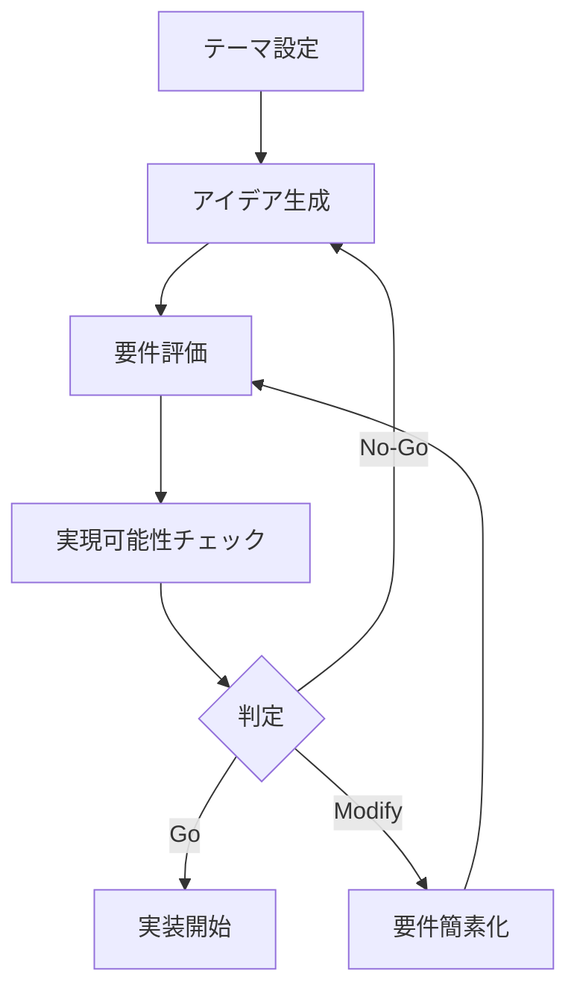

# 要件定義プロンプト使用ガイド

## 概要
このガイドでは、要件定義プロンプトを使った実際のアプリケーション開発フローを説明します。

## 📋 全体フロー



## 🎯 Step 1: テーマ設定

### 良いテーマの例
- ✅ 「日常の小さな達成感を可視化する」
- ✅ 「音声で記録する個人日記」
- ✅ 「AIが生成する1日1枚のアート作品」

### 避けるべきテーマ
- ❌ 「総合的なプロジェクト管理ツール」（スコープが広すぎる）
- ❌ 「SNSプラットフォーム」（機能が多すぎる）
- ❌ 「ECサイト」（決済など複雑な処理が必要）

## 🚀 Step 2: アイデア生成の実践例

### 入力例

```
テーマ: 「毎日の気分を色で記録する」
```

### AIへのプロンプト

```
あなたは経験豊富なプロダクトマネージャーです。以下のテーマと制約条件に基づいて、10個の革新的なWebアプリケーションのアイデアを生成してください。

### テーマ
毎日の気分を色で記録する

### 利用可能な技術スタック
- フロントエンド: React, TypeScript, Tailwind CSS
- バックエンド: Supabase (認証、データベース、リアルタイム機能)
- AI機能:
  - 音声入力 (Web Speech API)
  - 画像生成 (DALL-E/Stable Diffusion API)
  - 動画生成 (Runway/Pika API)
  - 音楽生成 (Suno/MusicGen API)

[以下、テンプレートの続き...]
```

### 生成されるアイデアの例

```markdown
#### アイデア #1: MoodPalette（ムードパレット）

**一言説明**: 気分を色で記録するビジュアル日記

**解決する課題**: 
- 従来の日記は文章化が面倒で続かない。視覚的に簡単に記録したい。

**価値提案**:
- タップ一つで今の気分を色として記録
- 月間/年間の気分の変化を美しいグラデーションで可視化

**コア機能 (BUC)**:
- 色選択による気分記録と可視化

**技術的実現方法**:
- 使用するAI機能: なし（シンプル実装）
- 必要なDBテーブル: moods (id, user_id, color, mood_text, created_at)
- 実装の容易さ: 高

**優先度スコア**: 9点
- 実現可能性: 5点
- インパクト: 4点
```

## 📊 Step 3: 要件評価の実践

### 評価シート記入例

```markdown
# MoodPalette 要件評価シート

## 基本情報
- **アプリ名**: MoodPalette
- **一言説明**: 気分を色で記録するビジュアル日記
- **想定ユーザー**: 日記を続けたいが文章が苦手な人
- **開発期間見積もり**: 6時間（AI実装）

## 1. 課題分析（20点）

### 1.1 課題の明確性（10点）
- [x] 課題が具体的に定義されている（5点）
- [x] ターゲットユーザーが明確（3点）
- [x] 市場ニーズが存在する（2点）
小計: 10/10点

### 1.2 解決方法の妥当性（10点）
- [x] 提案された解決方法が課題に適している（5点）
- [x] 既存の解決方法より優れている点がある（3点）
- [x] ユーザー体験が向上する（2点）
小計: 10/10点

## 総合評価
- 課題分析: 20/20点
- 技術的実現可能性: 28/30点
- データベース設計: 18/20点
- ユーザー価値: 25/30点
- **合計: 91/100点**

### 推奨度
- [x] 強く推奨（80点以上）
```

## ✅ Step 4: 実現可能性チェックの実践

### クイック判定の例

```markdown
# MoodPalette 実現可能性クイック判定

## 🟢 グリーンフラグ（実装推奨）
- [x] すべての必須要件を満たす
- [x] 既存の技術スタックで完結
- [x] 類似実装の経験あり

## 🟡 イエローフラグ（要検討）
- [ ] 一部新技術の学習が必要
- [ ] DB設計がやや複雑
- [ ] UI実装に時間がかかる可能性

## 🔴 レッドフラグ（実装困難）
- [ ] コア機能が複数ある
- [ ] 外部API依存度が高い
- [ ] 6時間では完成困難

### 判定結果
[x] Go（実装開始）
```

## 💡 並列実行のテクニック

### 複数テーマの同時評価

```
以下の3つのテーマについて、それぞれ3個のアイデアを生成してください：

1. 「毎日の気分を色で記録する」
2. 「AIが選ぶ今日の一曲」
3. 「声で残す未来への手紙」

各テーマのベストアイデアを選出し、実現可能性を比較してください。
```

### バッチ評価

```
以下の5つのアイデアについて、実現可能性スコアのみを算出してください：

1. MoodPalette: [概要]
2. DailyArtAI: [概要]
3. VoiceTimeCapsule: [概要]
4. OneMinuteStory: [概要]
5. EmotionMusic: [概要]

スコアが最も高い2つを詳細評価してください。
```

## 🎯 成功のポイント

### 1. スコープを小さく保つ
- 最初は「これだけ？」と思うくらいシンプルに
- 機能追加は後からでも可能
- MVPに集中する

### 2. 技術的冒険を避ける
- 新しいライブラリは使わない
- 実績のあるパターンを採用
- エッジケースは考えない

### 3. ユーザー価値を明確に
- 「誰が」「いつ」「なぜ」使うのか
- 1文で価値を説明できるか
- デモで見せやすいか

### 4. 時間配分を意識（AIによる6時間実装）
- アイデア生成: 30分
- 評価・選定: 15分
- 設計: 15分
- 実装: 4時間
- テスト・デプロイ: 1時間

## 📚 リファレンス

### プロンプトファイル
1. `idea-generation.md` - アイデア生成用
2. `requirements-evaluation.md` - 詳細評価用
3. `feasibility-checklist.md` - 実現可能性確認用
4. `example-usage.md` - 本ガイド

### 次のステップ
選定したアイデアが決まったら、`/prompts/code-generation/`のプロンプトを使って実装を開始します。